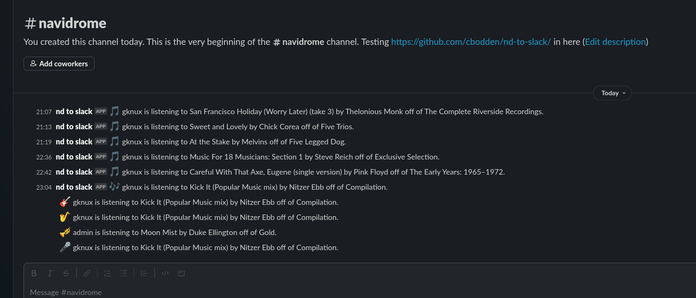
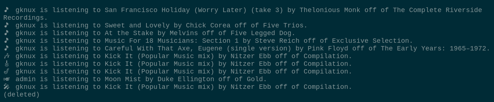
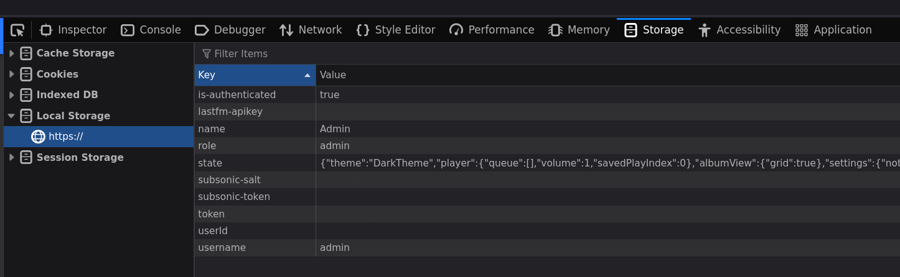
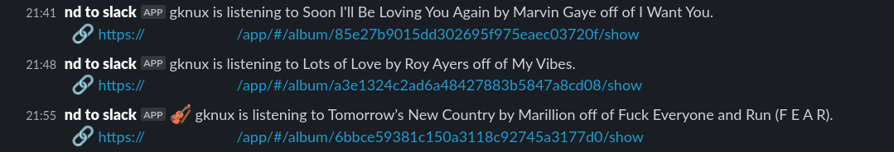
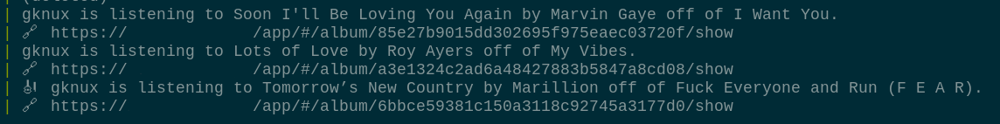

[](http://unlicense.org/)

```

                :::.    :::.:::::::-.      ::::::::::::   ...
                `;;;;,  `;;; ;;,   `';,    ;;;;;;;;''''.;;;;;;;.
                  [[[[[. '[[ `[[     [[         [[    ,[[     \[[,
                  $$$ "Y$c$$  $$,    $$         $$    $$$,     $$$
                  888    Y88  888_,o8P'         88,   "888,_ _,88P
                  MMM     YM  MMMMP"`           MMM     "YMMMMMP"


                 .::::::.  :::      :::.       .,-:::::  :::  .
                ;;;`    `  ;;;      ;;`;;    ,;;;'````'  ;;; .;;,.
                '[==/[[[[, [[[     ,[[ '[[,  [[[         [[[[[/'
                  '''    $ $$'    c$$$cc$$$c $$$        _$$$$,
                 88b    dPo88oo,.__888   888,`88bo,__,o,"888"88o,
                  "YMmMY" """"YUMMMYMM   ""`   "YUMMMMMP"MMM "MMP"

```

nd-to-slack.sh
====

    A script that will display your navidrome users activities in slack.
    The messages will be formatted:
    "<USER> is listening to <SONG> by <ARTIST> off of <ALBUM>."

ScreenShots
----
- In Slack:

- In Wee-slack:


Configuration
----
Before this script can be used you need to copy the
nd-to-slack.config.EXAMPLE file and copy it to nd-to-slack.config
and change all values listed as "\<CHANGE ME\>" to working values.

- nd-to-slack.config.EXAMPLE
```
USER="<CHANGE ME>"
TOKEN="<CHANGE ME>"
SALT="<CHANGE ME>"
SERVER="<CHANGE ME>"
URL_API="https://hooks.slack.com/services"
URL_HOOK="<CHANGE ME>"
EMOJI="3"
LINK="1"
```


Let us start with USER, TOKEN, and SALT.
On your navidrome server (this was done with Firefox), once on your
navidrome home page, right click, and inspect. In the inspection pane click
storage at the top and then local storage on the left hand to have a window
similar to the one below:



- Copy the role / name / username value to USER.
- Copy the subsonic-salt value to SALT.
- Copy the subsonic-token value to TOKEN.

Now, lets change the server address to whatever your servers URL is.

The slack URL_API and the URL_HOOK have been covered in many other places.
You just need to add an app to slack and grab the webhook url. Once grabbed
here is the breakdown:
<pre><code>
https://hooks.slack.com/services/TTTTTTTTTTT/QQQQQQQQQQQ/XXXXXXXXXXXXXXXXXXXXXX
|           URL_API             |                URL_HOOK                     |

</code></pre>

For vanity reasons there is a var called "EMOJI". This setting is 1, 2, or 3.
- 1 = no emoji set in the messages
- 2 = "musical_note" :musical_note: is set for all messages.
- 3 = Randomized

If none is set it will default to "3".

If you want to post with a link to the album you have to change the config
var "LINK" to "1".
- Appearance with links in Slack:

- Appearance with links in Wee-Slack:



We also need to change the DIR path in the script itself towards the top.
This sets the hardcoded path to the folder location of this script and to the
config folder in case you are running this script in cron.

Once all the Vars are changed now the script can be started. That will be
covered in usage.


Usage
----
This script can be run a couple of different ways. Two of the easiest are
by using either cron or doing a while loop at the command line.

- while loop approach
<pre><code>while :; do ./nd-to-slack.sh ; sleep 300 ; done</code></pre>

- crontab approach
<pre><code>*/5 * * * * /path/to/nd-to-slack.sh >/dev/null</code></pre>

While the script runs if the server has no acivity the script will not
post any messages until there is activity again and it wont repost a
presently playing song if the loop / cron time is set short.

This script was test with cron at 1 minute intervals.

Requirements
----
- Navidrome - music server (https://www.navidrome.org/)
- JQ - JSON Processor (https://github.com/jqlang/jq)
- cURL - (https://curl.se/)
- slack - Web-based instant messaging service (https://slack.com/)


License and Author
----
Copyright (c) 2024, cesar@poa.nyc
All rights reserved.

This source code is licensed under the Unlicense
found in the LICENSE file in the root directory of this
source tree.
